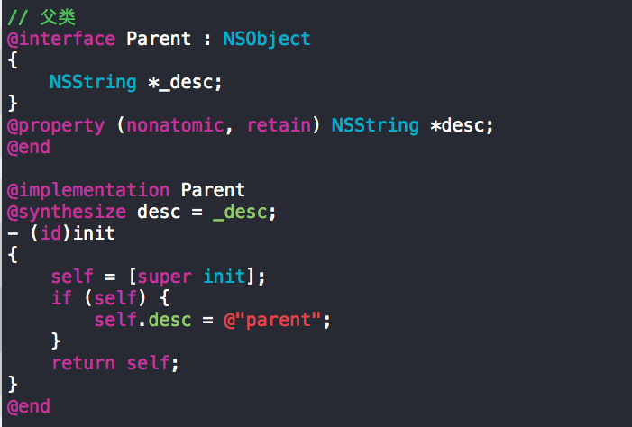
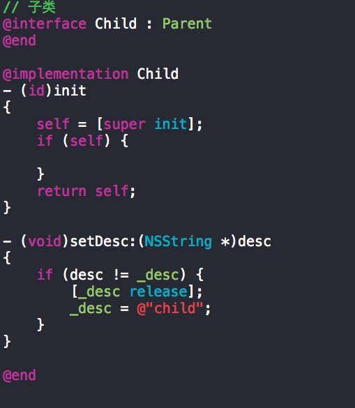

之前一直知道苹果建议不要在init和dealloc方法中，使用属性相关的setter和getter方法，一直没有搞清楚为什么，我的代码中有很多在init和dealloc中直接使用属性的setter和getter方法的。今天特意查了下相关的资料，并写了些测试代码，与大家分享一下。

下面的文章是唐巧写的，大家可以看看。

[http://blog.devtang.com/blog/2011/08/10/do-not-use-accessor-in-init-and-dealloc-method/](不要在init和dealloc函数中使用accessor)

遗憾的一点是，上面的文章并没有从代码上展现为什么会出问题，下面是我写的一个测试代码，大家可以看看有什么问题。

注意的一点是，子类中，重写了setter方法。ok, 问题来了！

	@implementation Child
	- (id)init
	{
	    self = [super init];
	    if (self) {
	
	    }
	
	    return self;
	}
	
**在子类的初始化方法中，我们调了[super init]，而在父类的init方法中，我们使用了setter方法，恰巧子类又重写了这个setter方法，那么，在父类的init方法中，就会调用到子类的setter方法，而这时候，子类本身这个实例对象还没有创建出来呢。在这种情况下，我们不能保证不会出现什么问题。**

**上述问题的出现有两个因素必须同时满足才会导致代码出现问题：
一就是在init使用了setter；二是子类重写了setter，导致在父类init时就会调用子类重写的setter，万一重写的setter中进行了一些子类特有的操作就可能会出现问题，比如，操作了一个子类中才有的实例变量。**

ok,上面的问题说完了，但是我觉着，出现这个问题的根本原因是objc是如何支持类的多态机制的，这部分的具体细节我还不清楚，应该和C++有很大的不同，或许，objc本身就不想去做的和C++那样的庞大冗余吧！who knows? I will dig into the code in the future。
