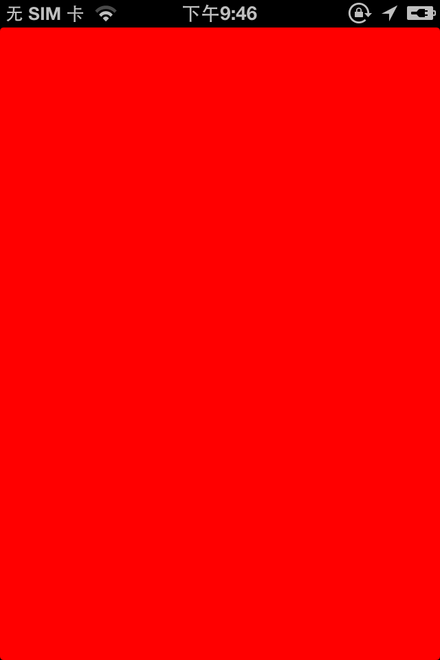
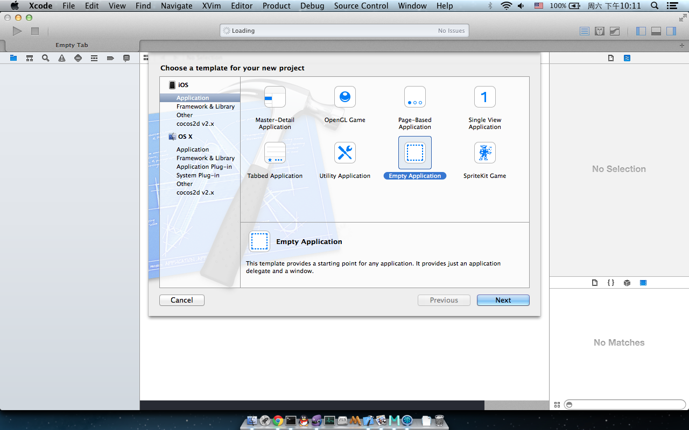

最近在学习如何在iOS开发中使用OpenGL ES 2.0进行绘图操作，有一些心得和经验，与大家分享。首先说明一点，这篇教程的目标读者是已经对iOS的开发有一些基础，但是对OpenGL ES 2.0没有任何基础，又希望在iOS开发中使用OpenGL ES 2.0的开发者。

这是本系列教程的第一部分，本部分的任务是使用OpenGL把View的背景色填充为红色，达到如下图所示的效果。

呃！是不是有点太简单了呢？直接设置`view.backgroundColor = [UIColor redColor];`不就搞定了吗？是很简单，现在让我们看看如何通过OpenGL ES 2.0来达到相同的效果吧！

OK，Let's coding! 

首先，在Xcode5下新建一个**iOS/Application/Empty Application**的工程，工程名为**HelloGLKit_1**。

我们先运行下，看看到如下图所示的画面。它仅有一个背景色为白色的UIWindow。

代码如下

- (BOOL)application:(UIApplication *)application didFinishLaunchingWithOptions:(NSDictionary *)launchOptions
{
    self.window = [[UIWindow alloc] initWithFrame:[[UIScreen mainScreen] bounds]];
    // Override point for customization after application launch.
    self.window.backgroundColor = [UIColor whiteColor];
    [self.window makeKeyAndVisible];
    return YES;
}


我们要使用OpenGL绘图，第一件事情就是要添加一个View，然后我们在这个View上进行OpenGL的绘图操作。对于iOS5以后，苹果新增了一套全新GLKit类库，通过GLKit我们可以比以前更方便的处理OpenGL相关的绘图操作。这里是GLKit的官方文档[Introduction to GLKit](https://developer.apple.com/library/ios/documentation/GLkit/Reference/GLKit_Collection/Introduction/Introduction.html#//apple_ref/doc/uid/TP40010915-CH1-SW1)，大家可以看看。

在本部分中，我们主要使用的是GLKit中提供的GLKView，我们将创建一个GLKView，并在它上面进行OpenGL ES绘图。[GLKView Class Reference](https://developer.apple.com/library/ios/documentation/GLkit/Reference/GLKView_ClassReference/Reference/Reference.html)，GLKView是UIView的子类，它有两个和OpenGL绘图相关的属性：

+	`@property(nonatomic, retain) EAGLContext *context`
+	`@property(nonatomic, assign) id<GLKViewDelegate> delegate`

对于任何OpenGL相关的绘图操作，必须有一个`EAGLContext`，它管理着OpenGL绘图相关的上下文信息。每次GLKView需要进行界面重绘时，都会调用`GLKViewDelegate`中的代理方法`- (void)glkView:(GLKView *)view drawInRect:(CGRect)rect`，我们会把具体的绘图细节放在这个代理方法了去实现，比如我们要的红色背景色。

下面我们来看看代码是怎么实现的。

首先我们需要引入GLKit，`#import <GLKit/GLKit.h>`


- (BOOL)application:(UIApplication *)application didFinishLaunchingWithOptions:(NSDictionary *)launchOptions
{
   self.window = [[UIWindow alloc] initWithFrame:[[UIScreen mainScreen] bounds]];
   // Override point for customization after application launch.
   
   EAGLContext *context = [[EAGLContext alloc] initWithAPI:kEAGLRenderingAPIOpenGLES2];
   GLKView *view = [[GLKView alloc] initWithFrame:[[UIScreen mainScreen] bounds]
                                          context:context];
   view.delegate = self;
   [self.window addSubview:view];
   
   
   self.window.backgroundColor = [UIColor whiteColor];
   [self.window makeKeyAndVisible];
   
   return YES;
}


