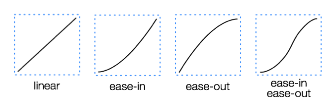
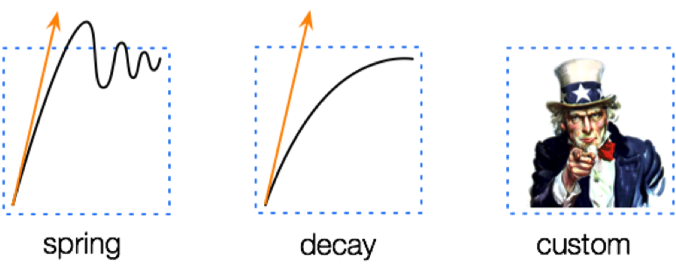
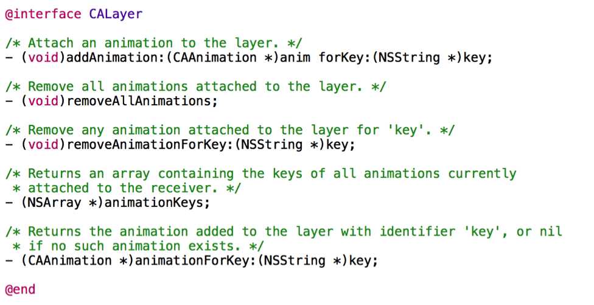
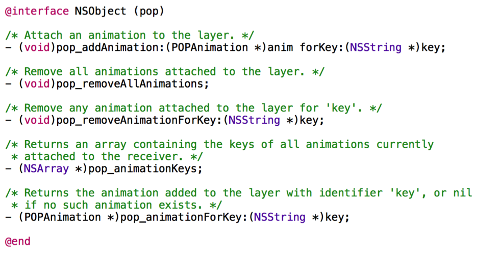
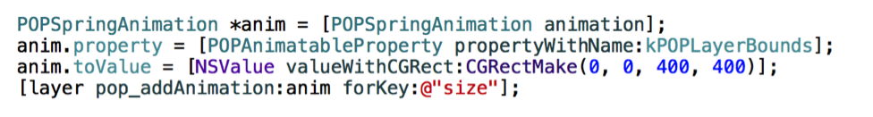

翻译自[Introducing Pop, the animation engine behind Paper](https://code.facebook.com/posts/234067533455773/introducing-pop-the-animation-engine-behind-paper/)

几个月之前我们发布了[Paper](https://code.facebook.com/posts/656530327776932/building-paper/)，可以流畅并且优雅的浏览和分享好的故事。今天我们开源了实现Paper应用平滑动画和转场效果的动画引擎Pop。使用动态动画(dynamic animations)而不是传统的静态动画(static animations)，Pop使常见的滑动(scrolling)、弹跳(bouncing)、折叠(unfolding)等效果充满了活力，也使Paper给人一种耳目一新的感觉。

##为什么需要Pop
从第一代iPhone开始，iOS系统在对静态动画(static animations)方面的支持就很出色。苹果提供的Core Animation framework，使我们很方便的使用线性动画(linear)、淡入效果(ease-in)、淡出效果(ease-out)等动画。

手势交互的革新迎来了新的一轮软件设计的浪潮。这在一定程度上间接使人们不再想直接操作屏幕上的一个个的按钮等界面控件，取而代之的，它提升了人们对屏幕本身就是一个媒介的期望。
> 译者注 我们之所以要去点击一个个的按钮，是因为这些按钮是一种媒介，通过点击它，可以给我们提供相应的功能。那么屏幕本身为什么就不能作为媒介呢？如果屏幕本身就可以作为媒介，我们是不是就不需要哪些丑陋的按钮了呢？

如果我们可以使我们的点击(touches)得到响应，那么我们也能同样的使我们轻扫的速度(velocity of flick)得到响应。

当我在2010年联合创办Push Pop Press公司的时候，我们的目标就是要创造一种可行的、基于物理效果(physics-everywhere)的体验。我们在寻求一种可以使人们非常愉悦、轻松的使用整个应用的解决方案，就像我们使用UIScrollView那样的顺滑。
> 译者注 如果你使用过Paper，你就会非常明白作者表达的是什么意思，强烈建议你用用看。我们现在的应用普遍都会存在一个问题，那就是在不同的页面直接进行切换，我们可能不会觉着我们通常的页面推入(push)、页面推出(pop)操作有什么不妥，但是作者却意识到了这些操作的生硬，他们在寻求一种更优雅、更顺滑的解决方案。Paper就是他们这种更优雅的解决方案的集中体现。

Pop就是这种理念的最新表现，它使你可以使用你熟悉而且强大的Core Animation进行编程，并且它能够捕获手势操作的速度，更好的反应用户的意图。Paper给我们了一个重新定义这种理念和其背后的动画引擎的机会。

##目标
Pop在三个不同的纬度提供了相应的工具。第一，我们想使一些常见动画的在使用上更加的简单便利。除了iOS内建的4种静态动画(static animations)，Pop增加三种原始的动画类型：弹簧效果(spring)， 衰变效果(decay)和自定义效果(custom)。

弹簧效果和衰变效果是动态动画，正是它们让Paper充满了活力动感。弹簧动画使Paper上的元素优雅的弹跳(attractive bounce)。衰变动画可以使元素的移动(movement)缓慢的停止。这两种动画都是把速度作为输入，并且都是在处理用户手势时的理想的方案之一。

第二，Pop是一个可灵活扩展的库。自定义的动画(custom animation)允许开发者插入自己的动画代码，使你可以容易的创造出独特的动画效果。通过把动画从展示层(display)解耦，Pop是一个适用范围更广的库，你可以对任何对象的任何属性做动画。
> 译者注这一点我个人认为是比较独特的想法，一般情况下，说到动画我们总会想当然的认为肯定是对展示层做动画，比如View、Layer等。但是Pop却将动画与展示分离出来，动画就是动画，可以对任何你想做动画的对象做动画，不仅仅是展示层元素。

第三，我们的目标是构建一个开发者友好但是功能强大的编程模型。比如，Core Animation开发者应该对下面的API比较熟悉：

开发者可以通过这些接口，使用Core Animation来开始和结束动画。最显著的一点是，它也支持查询正在运行中的动画，这是中断动画和构建流畅的用户界面的关键。下面是Pop实现相同功能提供的API：

最基本的动画类型是POPAnimation，由于Pop是在NSObject上扩展的类别，所以可以在任何对象上做动画。除了上面提到的区别外，这些API接口形式在其它方面都没有什么区别。

下面的例子展示了如何对layer的bounds属性做弹簧动画：

如果你会使用Core Animation构建动画，那么你也会用Pop，它们在使用上是相同的。

##开源
Pop是我们最新开源的代码项目，除此之外，我们开源的还有KVOController, Shimmer, 和 Tweak。我们非常期待你的反馈和贡献。
你可以在[这里](https://github.com/facebook/pop)查看Pop的整个源码工程。
