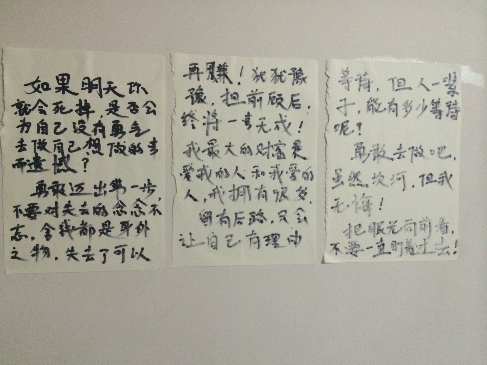

今天终于把离职办完了，也意味着我正式开始了无业游民的生活了。走出公司时，除了些许的不舍，心情却是很平静的。虽然即将面临着没有固定收入所带来的安全感，虽然期权的诱惑也让我有些遗憾，但是，自己内心的追求才是最重要的，不是吗？

人这一辈子，可能真的很短暂，说不定明天你就会突然的死掉了，在那一刻，你会为自己没有勇气去做自己想做的事情而后悔不已吗？但是那个时候，什么都来不及了，留给我们的将只有遗憾。

可能我们都习惯了每天上班的日子，那种安全感，不用操心乱七八糟的事情，只要做好自己的分内的工作就可以了。每天忙忙碌碌的，加班，赶地铁...好像我们真的很忙，但是当我们静下心来想想的时候，我们是否很充实呢？我们是否忙的有价值呢？可能很多人都回答不了这个问题吧。

每个人都有自己的舒适区，很多人都不愿意主动的跨出自己的舒适区，因为在这里面，很安全。但是往往我们要得到更大的进步的时候，就必须主动的跨出自己的那一片小天地，去主动接触更广阔的空间，虽然一路坎坷，但是，撑过去了，你就会得到更大的成长，开阔一片不一样的蓝天。

今天，我迈出了这最关键的一步。不管怎样，我都为自己感动。

给自己留出一点时间，给自己一个尝试的机会，去做点一直想做的事情。

不知道看到这篇文章的你会不会有一些感触呢？最后，送给大家几句话，这也是送给我自己的话。

