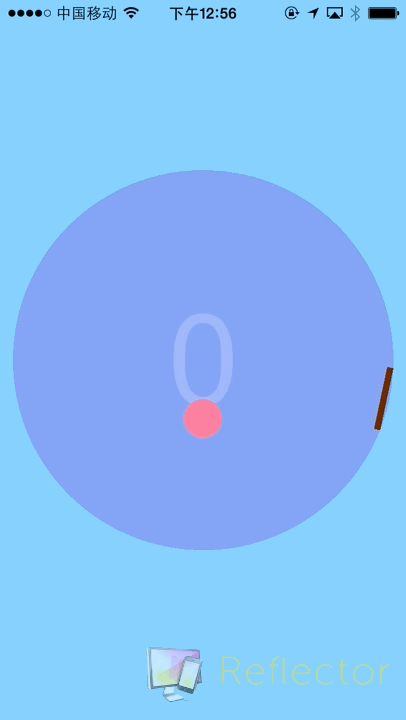
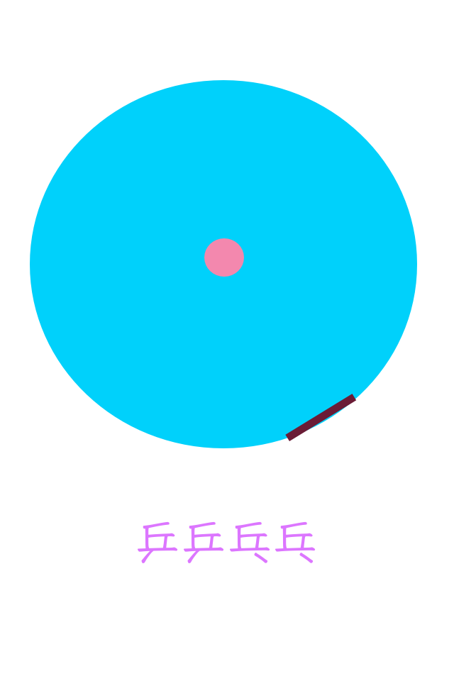
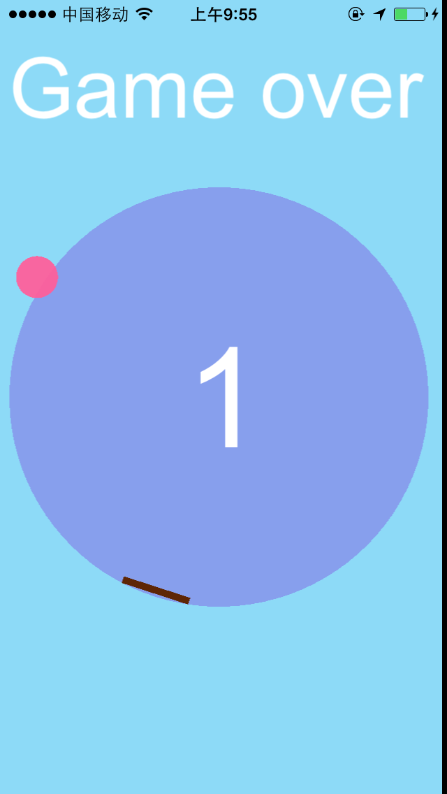
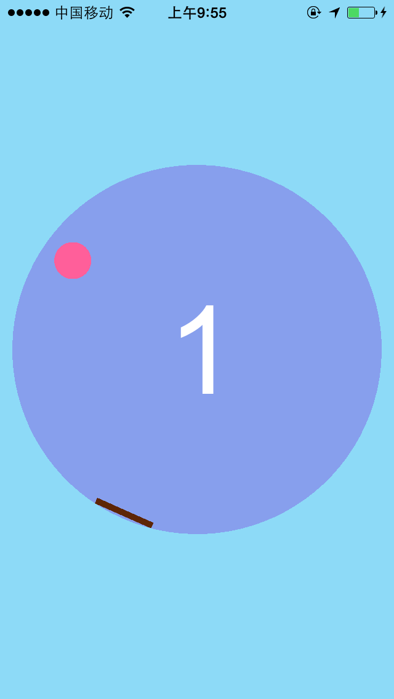

玩过flappy bird的你肯定明白在正确的时间轻触屏幕是多么的重要，乒乒乓乓也是一款有着同样要求的休闲游戏。

游戏的道具很简单：一个会下落的球和一只会旋转的挡板，点击屏幕开始后，圆球就会开始下落，同时挡板也开始逆时针转动，你的任务就是在适当的时间点击屏幕，让挡板回转一段距离并击中圆球，击中的次数越多，分数越多。

你的左脑发达吗？快来挑战一下吧！

什么？你flappy bird玩到了50多分？这都弱爆了，据说游戏的作者认为不会有人能够玩到30分，那就太逆天了。

还在等什么？快来让你的左脑惊爆你的小伙伴们吧！

下面开始爆照了，小伙伴们都等不及了！

如果你在使用的过程中，有任何疑问，欢迎联系我们。
Email:	happyjiahan#gmail.com (将#替换为@)