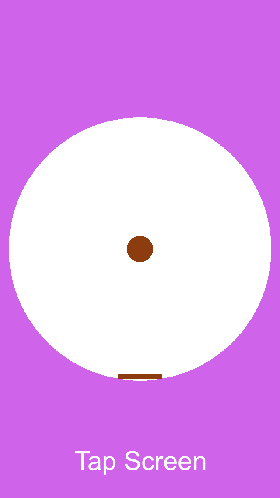

玩过flappy bird的你肯定明白在正确的时间轻触屏幕是多么的重要，**[Pongo多彩畅玩版](https://itunes.apple.com/WebObjects/MZStore.woa/wa/viewSoftware?id=879776425&mt=8)**也是一款有着同样要求的休闲游戏。

游戏的道具很简单：一个会下落的球和一只会旋转的挡板，点击屏幕开始后，圆球就会开始下落，同时挡板也开始逆时针转动，你的任务就是在适当的时间点击屏幕，让挡板回转一段距离并击中圆球，击中的次数越多，分数越多。

你的左脑发达吗？快来挑战一下吧！

什么？你flappy bird玩到了50多分？这都弱爆了，据说游戏的作者认为不会有人能够玩到30分，那就太逆天了。

还在等什么？快来让你的左脑惊爆你的小伙伴们吧！

新功能：
★ 添加游戏高分榜，看看你在小伙伴中排第几 
★ 添加了多套精心挑选的色彩主题，纯净的色彩正等待着你去解锁它们呢 
★ 添加了对英文的国际化支持

Your goal is to keep the ball bouncing inside the wheel. All you need is one paddle and your reflex. You can control only the direction of paddle movement just by tapping the screen. The rules are simple but still demanding. Most people may be difficult to score 5 points, how much can you score?

New Features:
★ GameCenter - Play with your friends, and it's time to show who is Da Man!

★ Colorful Themes - We choosed several colorful themes, with these beautiful colors, you will be happy all day. Of course, you must score higher to unlock them.

★ SNS Share - You can show off you score to Twitter, Facebook And Sina Weibo. Let your friends know who is the BOSS!

★ Supported for English

下面开始爆照了，小伙伴们都等不及了！点击下载**[Pongo乒乒乓乓](https://itunes.apple.com/WebObjects/MZStore.woa/wa/viewSoftware?id=879776425&mt=8)**吧。

如果你在使用的过程中，有任何疑问，欢迎联系我们。
Email:	happyjiahan#gmail.com (将#替换为@)