翻译自[iOS Games by Tutorials](http://www.raywenderlich.com/store/ios-games-by-tutorials)一书中的第八章，感谢原作者Marin Todorow的精彩文章。

到目前为止，你已经学会了如何通过手动改变位置(positioning)或者执行动作(actions)的方式来移动你的精灵(sprites)。但是，如果你要模拟真实世界中的行为，你该怎么办呢？比如使小球从摇摆的柱子上回弹、使一排多米诺骨牌倒下或者使由纸牌堆起的房子倒塌等等。

你可以通过一堆的复杂的数学计算来实现上面的效果，但是我们还有更简单的方法。Sprite Kit 内建了一个强大的并且非常容易使用的物理引擎，你可以很容易的使用这个内置的物理引擎来模拟真实世界中的移动。

使用物理引擎，你可以实现你在很多流行的游戏中看到的效果：

+	**Angry Birds**: 使用物理引擎模拟小鸟撞击上瓦片做的塔时的效果。
+	**Tiny Wings**: 使用物理引擎模拟小鸟越过山头飞向天空的效果。
+	**Cut the Rope**: 使用物理引擎模拟绳子的移动和糖果受重力影响的效果。

当和触摸控制配合时，有物理引擎就太棒了，因为它们让你的游戏看起来更真实、更具有动态性，就像你在 Angry Birds 中看到的那样的瓦块塔毁坏时的效果。

如果你喜欢这种粗鲁的物理效果，你想知道如何制作自己的基于物理引擎的游戏，你来对地方了，我们会提供给你一顿丰盛的大餐的。

在本章中，你将通过一个测试工程来开始学习 Sprite Kit 的物理引擎。你将会添加几个不同属性的物理形状，并且使细小的沙子以非常酷和动态的方式在它们周围流动。

在后面的两章中，你将在这些基础知识的基础上继续制作你自己的基于物理引擎的、通过触摸控制的游戏，当然也有很粗鲁的效果(对猫来说)!

##Sprite Kit 物理引擎

Sprite Kit 底层使用了 Box2D 这个库，由这个库来进行所有的物理计算。Box2D 是一个非常优秀的开源物理引擎库 －－特性齐全，快速并且强大。实际上，它已经被广泛使用在了很多流行包括iPhone, Android, BlackBerry, Nintendo DS, Wii, OSX and Windows等各种平台上的游戏中了 －－ 所以，我们很高兴它成了 Sprite Kit 的一部分。

但是，Box2D 对于 iOS 开发者来说由两个主要的缺点：它是用 C++ 而不是 Object-C 实现的，它可以拥有更好开发者友好性，特别是对初级的开发者来说。

苹果公司并没有直接把 Box2D 暴露出来 －－ 取而代之，它用 Object-C 重新抽象了一层，可以直接使用 Sprite Kit 中的 API 调用。事实上，苹果公司把 Box2D 封装的足够好了，甚至可以在新的版本中替换底层的物理引擎，而你什么都不用关心。

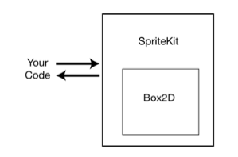

长话短说－－在 Sprite Kit 中，你可以使用这个超级流行的物理引擎的所有功能，但是是以一种更友好，更优雅的苹果风格的API。

##物理实体

为了让物理引擎控制你的精灵的移动，你必须为你的精灵创建一个物理实体(physics body)。你可以把一个物理实体
看做是你的精灵碰撞检测时的大概的轮廓。

下面的示意图展示了一个精灵的物理实体的可能的样子。注意一点，物理实体的形状不需要和精灵的边界非常精确的一致。通常，你会选择一个更简单的形状，这样碰撞检测的算法会运行的更快一些。

只要你给精灵设置了物理实体，它就可以像在真实世界中那样的移动－－它可以受重力的作用下落、可以受脉冲和推力的影响、可以和其他的物体碰撞后做相应的移动。

你可以调整你的物理实体的属性，比如它们的重量和弹性。你也可以修改整个仿真世界的物理法则－－比如，你可以减少重力，这样小球落到地面上可以回弹的更高更远。下面的图片展示了两个小球被抛出并且回弹了一段时间－－红色的小球是在正常的地球重力影响下的，蓝色的小球是在一个低重力环境中的( 比如说在月球上 ):

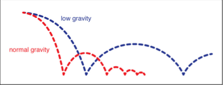

关于物理实体你需要知道下面的事情：

+	**物理实体都是刚体**。换言之，物理实体不会由于压力的作用而被压扁或者变形，并且不要由于物理仿真模拟而改变物理实体的形状。举例来说，你不能模拟一个在地面上滚动而变形的被压扁的球。

+	**物理实体必须都是凸边形**。一个物理实体可以是下面这些形状：一个矩形，一个圆形，一个链条形状或者是一个凸多边形。凸多边形的流行说法是 “ 这个形状的所有的内角必须都要小于180度”。你将会在第十章 “物理引擎高级技术” 中了解到为什么会有这样的要求和绕过这个要求的方法。

+	**物理实体在推力或脉冲力的作用下移动**。物理实体由于被施加了推力或脉冲力而移动。脉冲力瞬间改变物体的动量(比如两个物体碰撞时的能量转移)，而推力会在一段时间内逐渐的影响物体(比如重力移动一个物理实体)。你也可以在物理实体上施加你自己的推力或者脉冲力－－比如，你可能会用一个脉冲力来模拟从枪中射出的子弹，而用一个推力去模拟发射火箭。你稍后会在本章节中更深入的学习推力和脉冲力。

Sprite Kit 的一个非常棒的事情就是它把所有的这些特性，还有很多其他的特性，封装的不可思议的简单好用。在苹果的典型方式中，大多数的这些配置都被充分预定义了。这意味着一个空白的 Sprite Kit 的工程已经包含了栩栩如生的物理环境，完全不需要设置。

##开始

让我来尝试一下吧。打开 Xcode ，从主菜单中选择 **File \ New \ Project...** 。选择 **iOS\Application\SpriteKit Game** 模版，点击 **Next** 。

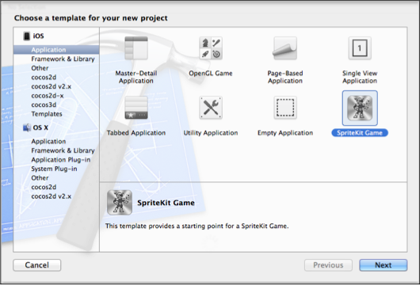

在工程名那里输入 **SpriteKitPhysicsTest**，选择 **iPhone** 设备，将 **Class Prefix** 留空并且点击 **Next**。

在你的硬盘上选好保存位置，然后点击 **Create**。这是 Xcode 会为你生成一个简单的 Sprite Kit 启动工程。

你想要使你的应用以 landscape 方式而不是 portrait 方式运行。就像你在第一章 “精灵” 中做的那样，在项目导航栏中选择 **SpriteKitPhysicsTest** 项目，然后选择 **SpriteKitPhysicsTest** target。在 **General** 栏中取消选中 Portrait ，这样就只有 **Landscape Left** 和 **Landscape Right** 是被选中的。

同样像你在第一章 “精灵” 中做的那样，打开 **ViewController.m** ，把 `viewDidLoad` 改为 `viewWillLayoutSubviews:`，做一些下面高亮处的小改动：

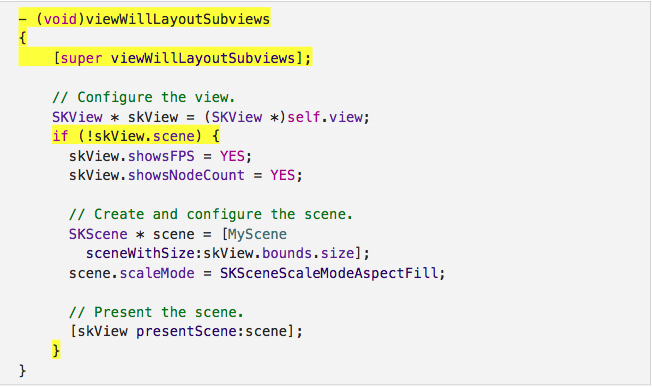

我们从一个空场景开始，打开 **MyScene.m** 文件，替换成如下内容：

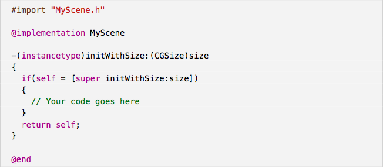

你通过一个空的 `initWithSize:` 方法创建了一个空的场景。在本章后面的部分，你所有的添加到 `initWithSize:` 方法中的代码都将被放在 `if` 语句内部，也就是注释 “Your code goes here” 所在的位置。

在本章的资源文件夹中，你会发现一个 **Shapes** 文件夹，里面有你需要的图片资源。把这个文件夹拖到你的工程中去，并且选择 **Copy items into destination group's folder (if needed), Create groups for any added folders**，并且选中 **SpriteKitPhysicsTest** target。

在 **视网膜4寸屏 iPhone 模拟器**上编译运行你的工程，确保你能看到一个 landscape 模式下的黑色屏幕：

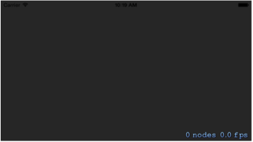

现在你已经有了一个空白的画板，让我们在上面加一些精灵吧。首先添加下面这些私有变量：

你定义的这些实例变量将用来存储一些测试用的精灵，你会把这些精灵加到屏幕上显示。下一步，在`initWithSize:`方法里面初始化这些精灵：

上面的代码在屏幕中间创建了三个精灵－－一个正方形、一个圆形和一个三角形。编译运行，你应该能看到下面的画面：

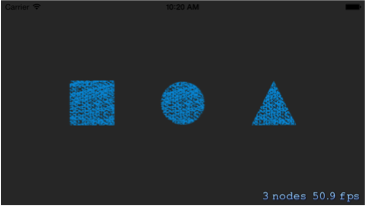

到目前为止，我们都是在复习前面章节中学到的东西。是时候介绍些新东西了－－让我们使这着精灵可以受物理引擎控制吧！

##圆形物理实体

从本章前面的内容中我们需要记住两件事：

1.	为了使物理引擎可以控制你的精灵的移动，你必须为你的精灵创建一个 **物理实体**。

2.	你可以认为一个物理实体就是你的精灵碰撞检测时的大概的轮廓。

让我们通过给圆形精灵附加一个物理实体来尝试一下这一点吧。把下面的代码添加到`initWithSize:`中其他代码的后面：

由于`_circle`精灵用了一个圆形的图片，你想创建一个差不多同样形状的物理实体。`SKPhysicsBody`有一个简单的工厂方法`bodyWithCircleRadius:`可以创建一个圆形的物理实体。

信不信由你，感谢 Sprite Kit 预配置的物理仿真，你已经做完了需要做的事情了，就是这么简单！

编译运行，你会看到这个圆形精灵会随着重力落下：

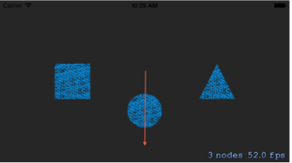

但是别急－－这个圆形精灵一直下落，跑出屏幕消失了！对于这个应用，你希望这个圆形在碰到屏幕的下边缘时就停止下来。

幸运的是，Sprite Kit 提供了一个简单的方式来做这种事情，我们可以使用一个edge loop body。

##Edge loop bodies

为了给屏幕添加上一个边界，你需要把下面的代码添加到`initWithSize:`中：

首先，你需要注意到你现在是正在给屏幕自己设置物理实体。任何 Sprite Kit node 都可以拥有一个物理实体，屏幕也是一个 node ！

然后，你需要注意到这次是一个不同类型的物理实体－－一个 edge loop body，而不是一个圆形的物理实体。这两种类型有下面的显著不同：

+	圆形物理实体是一个动态的物理实体(比如，它可以移动)。它是一个刚体，拥有质量，可以和任何其他类型的物理实体产生碰撞冲突。物理仿真系统可以施加不同的力去移动这些基于体积的实体(volume-based)。 

+	edge loop body 是一个静态的物理实体(比如，它不可以移动)。正如名字所暗示的那样，一个 edge loop 仅仅定义了一个形状的边界。它没有质量，不能和其他 edge loop bodies 产生碰撞，并且它也不从不会被物理仿真系统移动。其他的物理可以在这个边界的内部或者外部。

我们最常使用 edge loop 的是定义碰撞冲突的区域来描述你的游戏的边界、地面、墙体、触发区域或者其他类型的不可移动的碰撞冲突区域。

由于你想让物理实体只能在屏幕的边界内移动，所以你给屏幕的物理实体创建成一个 edge loop，并且把屏幕的 `frame`传入做为一个`CGRect`参数。

编译运行一下，看看它是怎么工作的。现在小球在碰到屏幕底部边缘时就会停下来，甚至稍微回弹了一些：

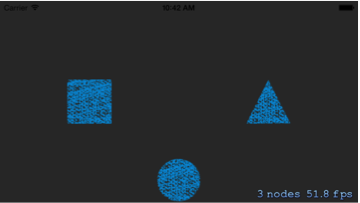

##矩形物理实体

下一步让我们为正方形精灵添加物理实体吧。把下面的代码添加到`initWithSize:`方法的结尾处：

你可以发现创建一个矩形的物理实体和创建一个圆形的物理实体非常的类似。唯一的不同之处就是你传入了一个代表矩形宽度和高度的`CGSize`参数，而不是传入圆形的半径作为参数。

编译运行，现在正方形精灵也会下落到屏幕的底部：

##自定义形状的物理实体

到目前为止你已经认识了一些简单的形状－－一个圆形和一个正方形。如果你的精灵的形状也如这些基本形状一样简单，那是很好的事情，但是如果你的形状相对更复杂一些呢？比如，没有内建支持的三角形。

幸运的是，Sprite Kit 提供了一种创建任意形状的物理实体的方法，可以使用 **Core Graphics path** 定义实体的边界。搞清楚它是工作机制的最简单的方式就是通过的例子－－让我们通过自定义一个三角形来尝试一下吧。

在`initWithSize:`的结尾处，添加如下代码：

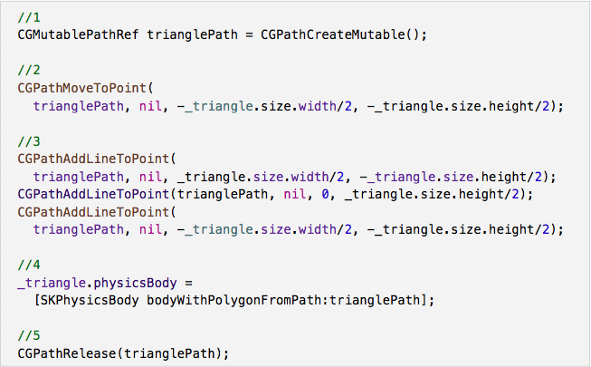

让我们一步一步的来看这些代码：

1.	首先你创建了一个`CGMutablePathRef`对象，你会使用它来画三角形。
2.	使用`CGPathMoveToPoint()`方法，移动你虚拟的笔到你想画的路径的起始点。注意一点，这里的坐标系统是相对于精灵的卯点(ancher point)的，精灵的卯点默认是它的中心点。
3.	然后你使用`CGPathAddLineToPoint()`画了三条连接三角形三个定点的直线。
4.	使用`bodyWithPolygonFromPath:`方法，并传入`trianglePath`作为参数，你创建了一个物理实体。
5.	最后，不要忘记调用`CGPathRelease()`方法，因为`CGPathCreateMutable()`方法通过 ARC bridge 返回给你的是一个 retain 过的 path。深入学习这方面的知识，你可以阅读 *iOS 5 by Tutorials* 一书中的第二章和第三章，标题为 “Begining and Intermediate ARC” 。	

编译运行，你会发现，现在所有的物体都会下落了：

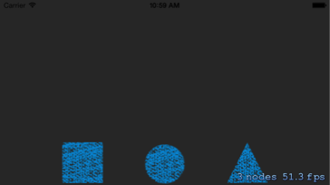

##可视化物理实体

上面的这三个精灵都拥有了一个和它们的形状相匹配的物理实体，但是现在你还没办法证明每个精灵的物理实体都是不同的。

让我们向这些物体倒入一些粒子去观察它们真实的物理形状。添加下面这个新方法：

在这个方法中，你使用 **sand.png** 创建了一个很小的圆形物理实体(就像你之前做的那样)，然后你把它随机的放在了屏幕的顶部。

让我们添加100个这样的小粒子，看看会发生什么！把下面的代码添加到`initWitSize:`方法中其他代码的后面：

你创建了一个顺序的动作(actions)序列，先调用`spawnSand`方法，再等待0.02秒。然后你再屏幕实例上重复执行了100次这个动作序列。

编译运行，你应该能看到细小的粒子－－这些小沙子－－像下雨似的落下来，然后填满了三个物理实体和地面之间的空隙。这难道不是很好看吗？

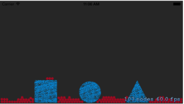

##物理实体的各种属性简介

除了碰撞检测外，物理实体还有很多其他的属性。一个物理实体也有一些属性是你可以设置的，比如物体的光滑度、弹性或者重量等。

让我们来调整沙子的各种属性，观察各种属性对游戏物理效果的影响。现在沙子下落的就像它很重似的－－更像岩石颗粒。要是这些粒子是由柔软的、有弹性的橡胶制作的，会产生什么现象呢？

把下面这行代码添加到`spawnSand`方法中：

`restitution`属性描述了当物理实体从另一个物体上弹出时，还拥有多少能量。基本上我们更习惯称之为“反弹力”。它的取值介于0.0(完全不会反弹)到1.0(和物体碰撞反弹时所受的力与刚开始碰撞时的力的大小相同)之间。默认值是0.2。

再一次编译运行，天呢，这些小球简直发疯了！

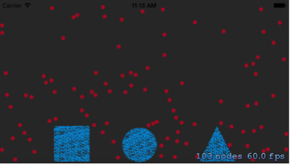

**注意**：Sprite Kit 默认把所有的物理实体的属性都设置了一个相对合理的值。一个物体的默认的重量取决于它在屏幕上看起来有多大；反弹力和摩擦力也同日常用品的材料相匹配，等等。

还有一件事情需要注意：尽管合法的`restitution`的取值必须介于0到1之间，但是如果你传入了一个超出范围的数值，编译器也不会有什么警告。但是，让我们考虑下如果取值大于1这意味着什么呢？这个物体在碰撞冲突完成时持有的能量比它最开始拥有的还多。这是不符合真实世界的行为的，并且会很快的使物理仿真模拟系统失效，因为这些数值增长到太大，以至于物理引擎无法准确的计算它们。在正式的应用中我是不推荐这么做的，但是尝试一下、玩一玩还是可以的。
	
下一步让我们增加这些粒子的密度，这样它们就比其他的物理实体更重了。看看它们使如何回弹的，这应该是有趣的场景。
	
把这行代码添加到`spawnSand`的后面：

密度是根据单位体积的质量来定义的－－换言之，密度越高，体积越大，物体就会越重。密度的默认值是1.0，所以在这里你把沙子的密度提高到默认情况的20倍。

这导致沙子比其他形状要重－－其他形状表现的就像海绵泡沫似的。编译运行，当仿真系统稳定后你应该能看到如下画面：

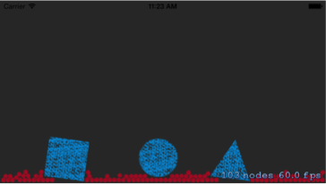

现在红色的粒子逐渐的把比它更大但是却更轻的蓝色的形状推倒了一边(The red particles now literally throw their considerable weight around and push the bigger (but lighter) blue shapes aside)。当你控制物理系统时，大小并不一定是最重要的！

下面是我们对剩下的物理实体的属性做一个快速的浏览：

+	**摩擦力(friction)**：这个属性决定了物体的光滑程度。取值范围为从0.0(在表面滑动时，物体滑动很顺畅，就像小冰块似的)到1.0(在表面滑动时，物体会很快的停止)。默认值是0.2。

+	**动态性(dynamic)**：有时候你想使物理实体可以碰撞检测，但是你想使用手动方式或者action的方式自己去移动物体。如果这就是你想要的结果，你可以简单的把这个属性设置为NO，物理引擎就会忽略所有作用在物理实体上的推力和脉冲力，让你自己负责物体的移动。

+	**启用精确冲突检测(usesPreciseCollisionDetection)**：默认情况下，除非确实有必要，Sprite Kit 并不会启用精确的冲突检测，因为这样更快。但是不启用精确的冲突检测会有一个副作用，如果一个物体移动的非常快(比如一个子弹)，它可能会直接穿过其他物体。如果这种情况确实发生了，你就应该尝试启用更精确的冲突检测了。

+	**是否允许旋转(allowsRotation)**：有些时候你可能想是你的精灵被物理引擎模拟，但是不想让它旋转。如果是这种情况，你可以简单的把这个标记为设置为NO就可以了。

+	**线速度阻尼(linerDamping)和角速度阻尼(angularDamping)**：这些参数影响线速度和角速度随着时间衰减的多少。取值范围为0.0(速度从不衰减)到1.0(速度立即衰减)。默认值是0.1。

+	**是否受重力影响(affectedByGravity)**：所有的物体默认情况都是受重力影响的，但是你可以简单的把这个标记位设置为NO，使其不受重力的影响。

+	**是否正在休息(resting)**：物理引擎对于在一段时间内没有移动过的物体做了一个优化，把它们标记为"正在休息(resting)"，这样物理引擎就不需要再对它们进行计算了。如果你想要手动的唤醒一个正在休息(resting)的物体，简单的把这个标记位设置位NO即可。

+	**质量和区域(mass and area)**：物理引擎会根据物理实体的形状和密度自动计算出这些属性。但是你也可以手动的去更改这些数值。

+	**节点(node)**：物理实体有一个方便的指针，表示它所属于哪一个`SKNode`。

+	**类别位掩码(categoryBitMask)，冲突位掩码(collisionBitMask)，接触点位掩码(contactBitMask)**：你会在第九章“Intermediate Physics”和第十章“Advanced Physics”中学习到所有的这些知识。