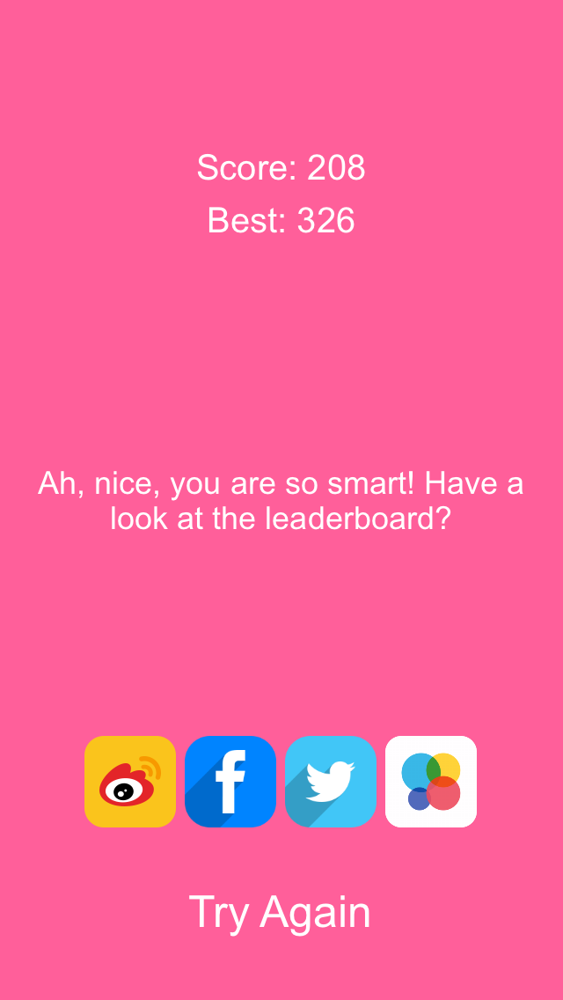
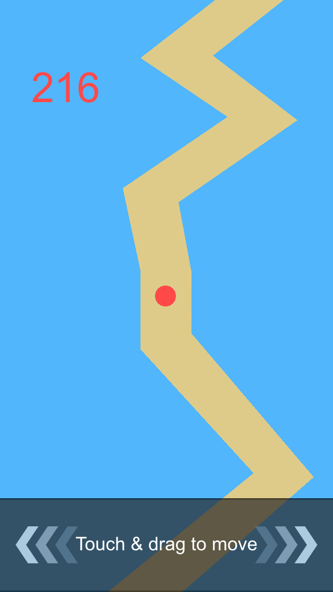
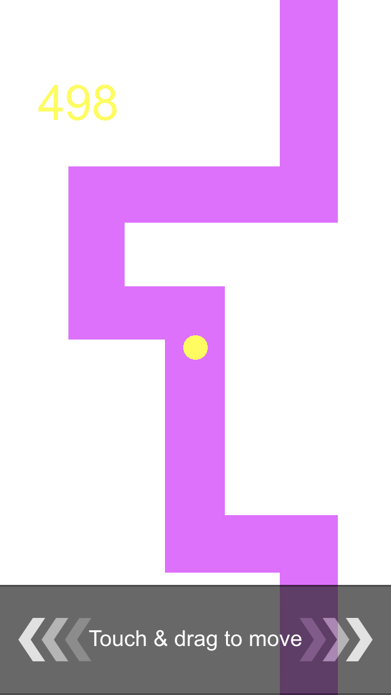
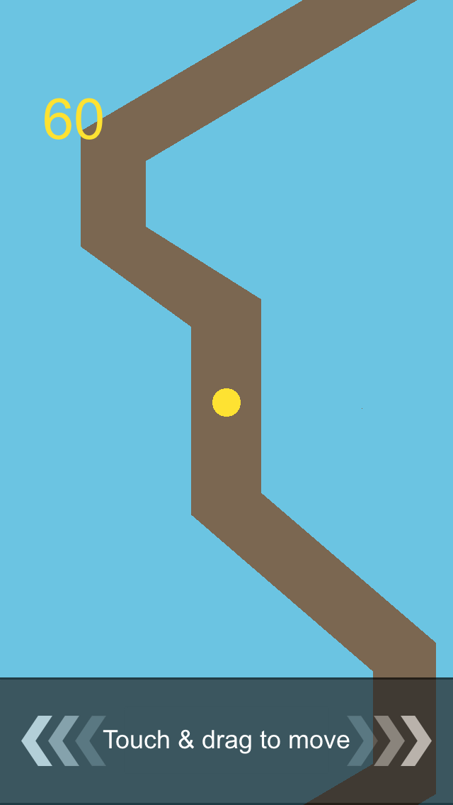
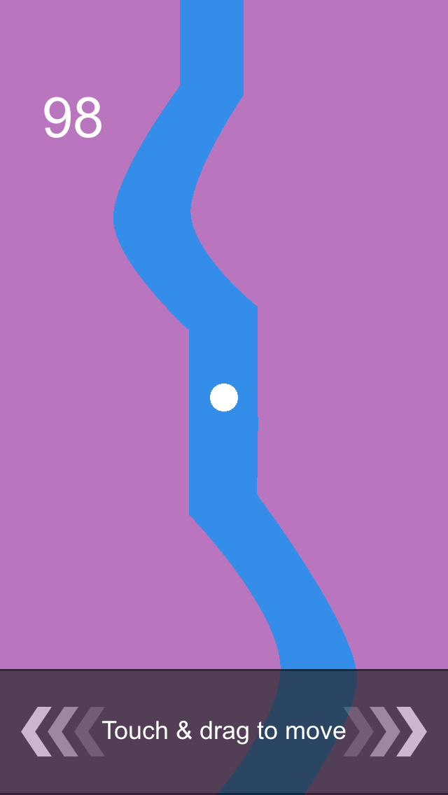

###inline colorful pro
The game has several well-chosen beautiful color scheme, are waiting for you to unlock them! Of course, you must get high scores. 
Leaderboard can let you show off high scores to your friends, challenge with them. 

Drag your finger to move the small ball, stay in the line, do not touch the line. 

Simple game but need much more ability to control time and eye grassland. The speed will faster and faster, but sometimes it slow down suddenly. You must keep an eye on the ball and the speed. 

Show you ability to control the ball, have fun! :)

###呆在线里多彩畅玩版
游戏内有几种精心挑选的配色方案，正等待着你去解锁它们哦！当然，需要你有足够的分数才可以哦！ 
游戏的排行榜功能，可以和朋友们一起玩耍，在排行榜中炫耀你的高分，让小伙伴们都膜拜吧！ 

游戏的规则很简单：移动你的手指，使小球随着手指左右移动，但是一定要保持小球始终在线内，你坚挺的时间越长，你的得分就会越高。 

小游戏虽然简单，但是很考验你的眼疾手快和对时间的掌控能力。游戏的速度会越来越快，但是又会突然慢下来，所以，你一定要时刻小心，把握好时间节奏，平滑的移动小球，一直呆在线里，不要碰到线上。 

###Rester dans la ligne arc-en-ciel
On a bien préparé plusieurs programmes de combinaison des couleurs. Va les déverrouiller ! Bien sur qu’il faut un score suffisant. Avec le tableau de l’ordre, joue avec tes copains et afiche ton score ! 

Règlement bien simple: bouge ton doigt, laisse bouger la boule avec ton doigt. Mais il faut garder la boule rester dans la ligne. Et plus lontemps, ton score est plus élevé. 

Bien simple, cela éprouve les yeux acérés et l'oreille sensible. Très rapide, mais bien lent soudain. Alors, fais attention et saisis le temps. Bouge la boule doucement. Rester dans la ligne et ne toucher pas la ligne ! 

感谢好朋友赵真为我提供法语版的翻译工作，非常感谢。

如果你在使用的过程中，有任何疑问，欢迎联系我们。
Email:	happyjiahan#gmail.com (将#替换为@)

Feel free to contact us.

Email:	happyjiahan#gmail.com (replace # with @)
