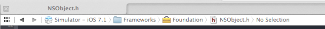
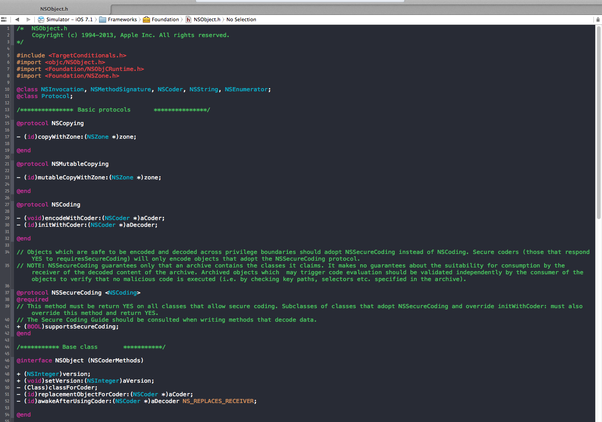
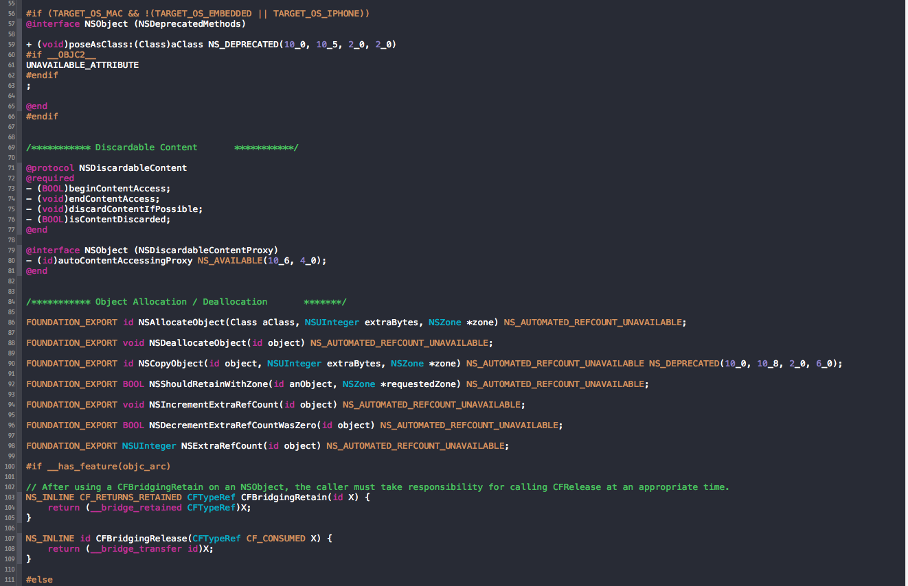
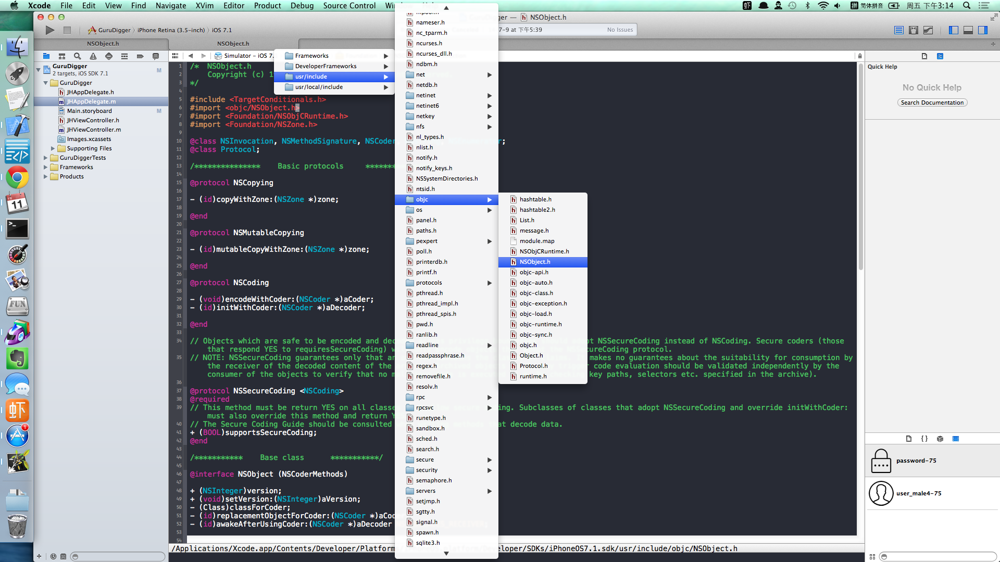
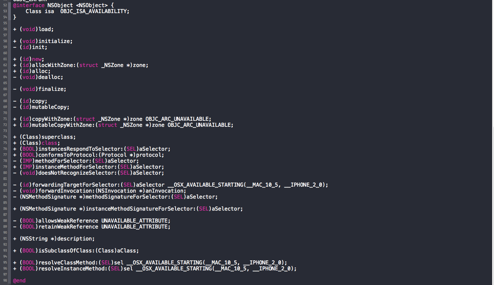
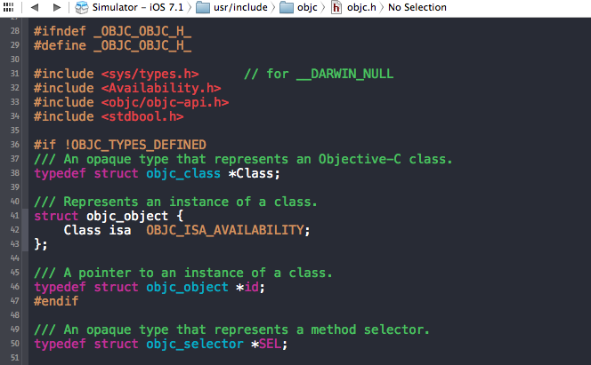
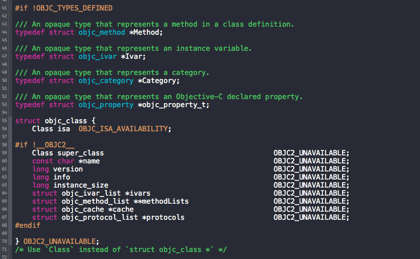

对于`NSObject`来说，我们可是非常熟悉的了，它是objc中大多数类的基类。注意，并不是所有的类都继承于`NSObject`，比如`NSProxy`类。详细的类图可以参考这篇文章[IOS 整体框架类图](http://www.350351.com/bianchengyuyan/Objective_c/112232.html)，讲的很详细。

既然要深入学习objc，我们不妨从最熟悉的`NSObject`类开始，让我们来看一看它的源码吧！

首先，我们来看看`NSObject.h`这个头文件，我们很容易从Xcode中进入这个文件中。它被包含在`Foundation/NSObject.h`路径下，如下图所示：

看了这个头文件，我们就有点疑惑了，怎么这个头文件了没有`NSObject`类的定义啊，只是定义了`@interface NSObject (NSCoderMethods)` 和 `@protocol NSCopying` 等几个类别和协议。那么真正的`NSObject`的类定义在哪里呢？

是不是使用`#import`从其他文件中引入的呢？看看这个文件的第6行代码，果然发现了我们想找到的头文件定义。
	
	#import <objc/NSObject.h>

我们找到这个头文件，如下图所示：

终于，我们找到了如下所示的`NSObject`的类定义：

看到了我们熟悉的`alloc`、`init`等方法。但是，下面这个结构我们有点陌生，`NSObject`只有一个成员变量是`Class`类型的`isa`变量。那么`Class`类型又是什么东西呢？看命名应该是指所属的类。
	
	@interface NSObject <NSObject> {
    		Class isa;
	}
	
我们进入`Class`中看看它到底是个什么东西。

我们发现`Class`就是一个结构体的指针而已。

	typedef struct objc_class *Class;

我们还需要在看看`objc_class`是个什么东西。

	struct objc_class {
	    Class isa  OBJC_ISA_AVAILABILITY;

	#if !__OBJC2__
	    Class super_class                                        OBJC2_UNAVAILABLE;
	    const char *name                                         OBJC2_UNAVAILABLE;
	    long version                                             OBJC2_UNAVAILABLE;
	    long info                                                OBJC2_UNAVAILABLE;
	    long instance_size                                       OBJC2_UNAVAILABLE;
	    struct objc_ivar_list *ivars                             OBJC2_UNAVAILABLE;
	    struct objc_method_list **methodLists                    OBJC2_UNAVAILABLE;
	    struct objc_cache *cache                                 OBJC2_UNAVAILABLE;
	    struct objc_protocol_list *protocols                     OBJC2_UNAVAILABLE;
	#endif

	} OBJC2_UNAVAILABLE;
	/* Use `Class` instead of `struct objc_class *` */	

可以看出来对于objc2和objc1的实现是不同的，我们现在只看objc2.0对应的版本，我们把objc 1.0的代码删掉，就只剩下如下结构了：
		
	struct objc_class {
		Class isa;
	};

真的是好简洁啊！

让我们再来对比一下`NSObject`的定义：
	
	@interface NSObject <NSObject> {
    		Class isa;
	}

我靠，这俩货怎么长的这么像啊！

有点乱，别急，我们撸一下。

首先，我们知道了`Class`类型就是objc_class结构体的指针，如下：

	typedef struct objc_class *Class;

而`objc_class`又如下定义，包含了一个指向自身类型的指针的变量`isa`。

	struct objc_class {
		Class isa;
	};

我们都知道objc中`id`也是一种对象类型，那么它究竟是什么呢？来看下面的定义：
	
	typedef struct objc_object {
	    Class isa;
	} *id;

原来`id`类型就是一个`objc_object`结构体的指针啊，这个`objc_object`的结构也仅仅包含一个`isa`变量。上述我们讨论的关键的几个数据结构`NSObject`，`objc_class`，`objc_object`都仅有一个`objc_class *` 类型，也就是`Class`类型的变量`isa`,可见`isa`这个变量是多么的重要啊。

我们可以得出这样的结论，在objc的runtime中，类是用`objc_class`结构体表示的，对象是用`objc_object`结构体表示的。
对象的`isa`用来标示这个对象是哪个类的实例。

下面我们来验证这一点，首先我们来看一段代码：

	NSString *str = @"hello world";
	if ([str isMemberOfClass:[NSString class]]) {
	    // str is actual an instance of NSString
	} else {
	    // str is not a NSString instance
      }

这是我们在实际的开发过程中经常用到的，用来判断`str`变量是不是`NSString`类型的一个实例。我们都知道`- (BOOL)isMemberOfClass:(Class)aClass`可以判断对象是不是某个类的实例。我们来看一下这个方法的源码是如何实现的。

首先，这些源码是属于objc runtime的，庆幸的是objc runtime的源代码苹果已经开源了，你可以在这里下载到[objc](http://opensource.apple.com/tarballs/objc4/)的runtime源代码。打开objc/Source/NSObject.mm这个文件，这就是`NSObject`的实现代码。大概浏览一遍，函数是不是有很多都非常熟悉呢？可以说这些函数接口我们每天都在用，这次终于该好好看看它们是怎么实现的了。

为了方便，我把其中一部分代码摘录出来，并把其中用到 Tagged Pointer 支持的代码去掉，关于 Tagged Pointer 我会单独写一篇文章来分析它，这里我们先忽略即可。

	- (BOOL)isMemberOfClass:(Class)cls {
	    return [self class] == cls;
	}

	- (Class)class {
	    return object_getClass(self);
	}

	Class object_getClass(id obj)
	{
	    return _object_getClass(obj);
	}

	static inline Class _object_getClass(id obj)
	{
	    if (obj) return obj->isa;
	    else return Nil;
	}

上面的代码非常直白，无需多言。我们注意下最后这个函数：

	static inline Class _object_getClass(id obj)
	{
	    if (obj) return obj->isa;
	    else return Nil;
	}

如果`obj`不空，返回的`Class`类型就是`obj->isa`,否则，返回的是`Nil`。这就从源码上证实了`isa`就是代表一个对象的类型。

通过上面的源码分析，我们搞明白了对于普通的对象实例，`isa`就是表明它所属的类型。通过调用`[obj1 class]`等方法返回的其实就是这个`isa`变量。

下面我们再来分析一下类objc_class，为什么它也有一个`isa`变量呢？
	
	struct objc_class {
		Class isa;
	};

在面向对象的设计中，万物皆对象，所以类(`Class`)也是一个对象，它也有一个`isa`，那么类的`isa`指向谁呢？

我们看这句代码`[NSObject class]`，这里我们调用了`+ (Class)class`这个类方法，我们再开发中经常用到这个方法，它返回的是这个类所属的Class类型。这是不是就可以作为一个**类也是一个对象**的佐证呢？

我们继续看看objc runtime的源码，你可以在objc/Source/NSObject.mm这个文件中找到下面的代码：

	+ (Class)class {
	    return self;
	}

是不是有点看不懂了？`[NSObject class]`这句代码返回的竟然是`self`，我们都知道对于一个类的实例来说，`self`总是指向其自身的，但是这里并没有实例啊，我们是直接调用了`NSObject`这个类的一个类方法`+(Class)class`啊。难道类本身也有一个`self`指针？

别急，我们再来仔细看看类方法`+(Class)class`的文档：

>Returns the **class object**.
>
>+ (Class)class
>Return Value
>The class object.
>

这个函数的返回值是一个类对象**class object**，所以其本质上还是一个对象而已。既然是一个对象，它拥有一个`self`指针是不是就不奇怪了呢？现在我们就明白了，对于像`NSObject`这样的类来说，它其实代表的是一个类对象，本质上还是一个普通的实例对象，类对象的`self`指针应该指向的是这个类对象自身。

是不是有点明白了？

但是，那这个类对象又是谁的实例呢？很遗憾，要找到这个问题的答案，我们在 objc runtime 这一层上已经没办法办到了，我们需要到更低层，也就是 objc 语言层去寻找答案了。因为`self`是 objc 的保留关键字，所以，objc 需要为这个关键字提供语言层面上的支持，我们要找到答案，可以从`self`这条线索入手，看看 objc 到底是怎样实现的？

感兴趣的同学可以研究下[clang](http://clang.llvm.org/)的源码，是用C++实现的，objc 的语言层就是用它来生成的，在clang/lib/CodeGen目录下有关于objc代码生成相关的代码，关于`self`到底是什么，我觉着可以从`LoadObjCSelf`这个函数入手去研究一下。

**总结：**本篇文章只是从我们经常用到的一些函数的源码出发，引出了对 objc 对象模型的一些思考，但是，并没有解释的非常清楚。我也是初次接触这块的东西，我会继续把我学习的一些心得体会记录下来，欢迎大家指正与讨论。下一篇文章我希望继续把 objc meta class 相关的内容与大家一起分享。

是不是觉着还不过瘾？那么请看看下面这些大牛的文章吧。

+	[The Objective-C object model](http://www.devalot.com/articles/2011/11/objc-object-model.html)

+	[Objective-C对象模型及应用](http://blog.devtang.com/blog/2013/10/15/objective-c-object-model/)

+ 	[What is a meta-class in Objective-C?](http://www.cocoawithlove.com/2010/01/what-is-meta-class-in-objective-c.html)
