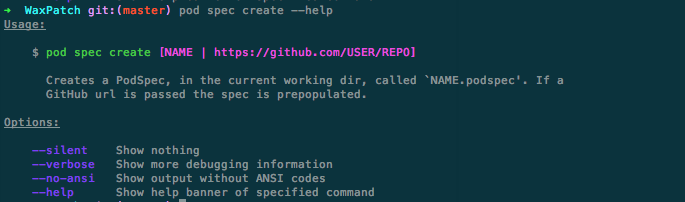
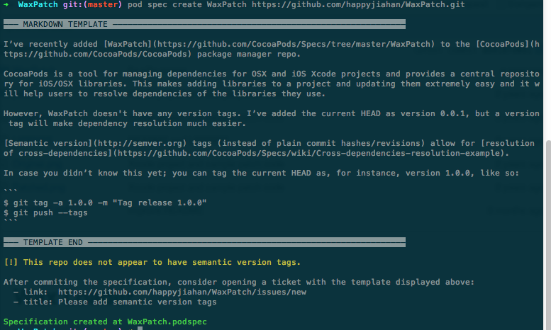
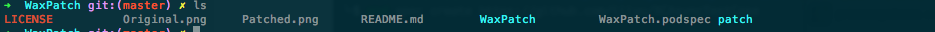
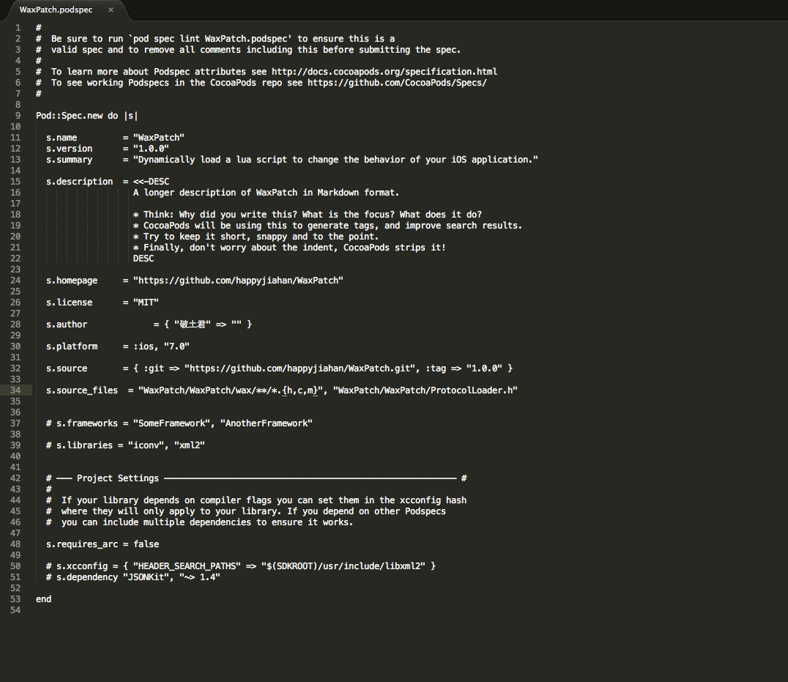

最近考察了一下 Lua 在 iOS 开发中的应用，重点考察了 Wax 框架，以及在其基础上修改的 WaxPatch 框架，感觉还不错，特别是能够使用这个技术进行热更新，不需要在漫长的等待 App Store 的审核时间。

本文主要为WaxPatch制作一个 cocoapods 库，方便在不同的工程中快速集成。

首先fork份 [WaxPatch](https://github.com/mmin18/WaxPatch) 的代码，我们在自己fork的那份代码上制作pod库。

然后把代码checkout 出来，在命令行中cd到这个本地目录下。

我们要制作自己的pod库，需要使用`pod spec create`这个命令。
我们先来看看这个命令的用法吧, 输入`pod spec create --help`，你能看到下面的帮助信息。

我们输入`pod spec create WaxPatch https://github.com/happyjiahan/WaxPatch.git`，会看到下面的信息：

上面说的很明确，说这个git库没有任何tag，而cocoapod 最好需要有一个tag。我们稍后再修正这个问题。现在我们`ls`一下，你会看到下面的信息:

我们可以看到WaxPatch.podspec已经创建成功了。

我们现在来解决上面那个没有tag的问题，很简单，我们需要先把git库打一个tag，然后再重新生成一遍spec库即可。
	
	git tag -a 1.0.0 -m "Tag WaxPatch 1.0.0"
	git push --tags
	pod spec create WaxPatch https://github.com/happyjiahan/WaxPatch.git
	
运行完上面这几条命令，你就成功生成了一个pod spec库了。

还没完呢，这只是生成了一个模版而已，还有一些具体的参数需要我们去配置呢。

打开WaxPatch.podspec这个文件，里面的注释很详细，建议仔细看看。下面的是我配置的详细参数：

配置好了后，我们需要运行`pod spec lint WaxPatch.podspec`命令，检查一下是不是一个合法的podspec库。

如果你得到了`WaxPatch.podspec passed validation.`的输出，恭喜你，你的pod spec通过检查了。

下面，我们需要把这个WaxPatch.podspec文件push到github上去，
	
	git add WaxPatch.podspec
	git commit -am "add WaxPatch.podspec"
	git push
	
搞定！现在你就可以使用` pod 'WaxPatch', :git => 'https://github.com/happyjiahan/WaxPatch.git'  `来使用这个pod库了。

当然，你也可以把WaxPatch.podspec提交到https://github.com/CocoaPods/Specs，这样其他人就可以直接使用`pod 'WaxPatch'`来使用这个库了。