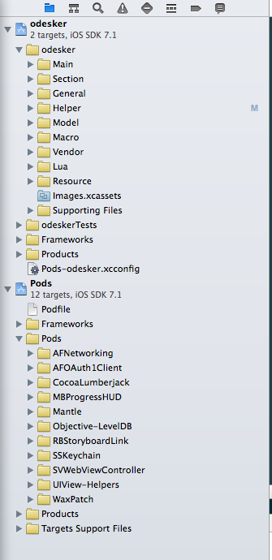
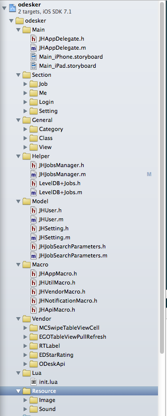
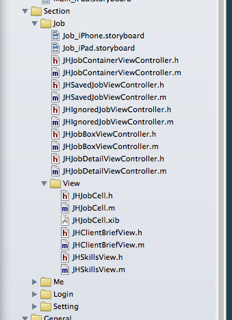

本文参考了[无网不剩](http://limboy.me/ios/2013/09/23/build-ios-application.html)的博客，收益匪浅，在此感谢。本文基本上就是抄袭了李忠所推荐的目录结构，所以，建议你看看他的文章[iOS项目的目录结构和开发流程](http://limboy.me/ios/2013/09/23/build-ios-application.html)。

我最近在做一个odesk 相关的 App, 主要就是利用 odesk 的开放 API，包装成一个 iOS 端的 App，方便手机用户使用。

先来看一下我的工程的主要结构，如下图所示：

我使用了 cocoapod 来管理我使用的一些第三方库，所以会有一个 Pods 的工程，整体上是一个 workspace 。这里建议把成熟的、而且不大会修改的第三方库使用 cocoapods 来管理，非常方便。但是对于那些你可能会经常修改的，而且修改时可能还会依赖自己的项目中得其他代码的库，个人建议先不要使用 cocoapod 来管理，最好先直接把源码拖到工程中，直接修改源码，当经过一段时间后，这部分代码可能就相对稳定了，这时，可以考虑把这个库拆分出来，再考虑适不适合使用 cocoapod 来管理。如果你还不熟悉 cocoapods , 建议你看看之前写得这两篇文章 [cocoapods 使用入门](http://blog.codingcoder.com/cocoapods-usage/) 和 [为WaxPatch制作pod库](http://blog.codingcoder.com/make-pod-for-waxpatch/)。

 OK，下面我们再来看看主项目的目录结构吧。

 
下面简单介绍下：
 
	1.	Main，这是程序的入口，包括 AppDelegate 和 Main.Storyboard。
	2.	Section, 这里放各个相对独立的业务模块相关的代码，比如登陆模块、设置页面等。
	3.	General，这里放一些通用的、可以在各个业务模块之间复用的代码。比如一些 Category, Class 以及一些基本控件等。
	4.	Helper，这里放得是一些辅助类，可以把一些Manager放在这里。
	5.	Model，这是模型类。可以把用到的基本模型类放在这里，比如User 模型类，Setting 模型类等。
	6.	Macro，这个目录主要放一些宏，并且再细分为 AppMacro, UtilMacro, VendorMacro等。
	7.	Vendor，这个目录是用来放一些第三方库或者其他的支持库的，并且这里存放的是一些和工程依赖比较严重的库，如果依赖不重，可以考虑使用 cocoapods 来管理。
	8.	Lua，	这个目录比较特殊，由于我在工程中使用了 Lua 技术，所以把 Lua 文件单独放在这里管理。
	9.	Resource， 这是资源目录，具体又包括 Image 和 Sound 两个细分目录，存放用到的图片和音频资源。
	
怎么样，这样组织是不是感觉整个项目的结构比较清楚呢。

对于第2条，对于每个业务模块，我们也可以在细分一下，如下图：

截图在手，无需多言。

总结：一个清晰的目录结构非常有助于代码的维护，当项目越来越大时，这种作用就会越来越明显。有时候可能这个类该放在哪个部分不是那么的明确，放在这里也可以，放在那里也可以，这个时候就不要纠结了，和同事商量一下，放在一个都好理解的地方就行了。这种东西，没有明确的对于错，只有是不是更好的适合你的项目。

最后，再一次感谢李忠提供的方案。
 

