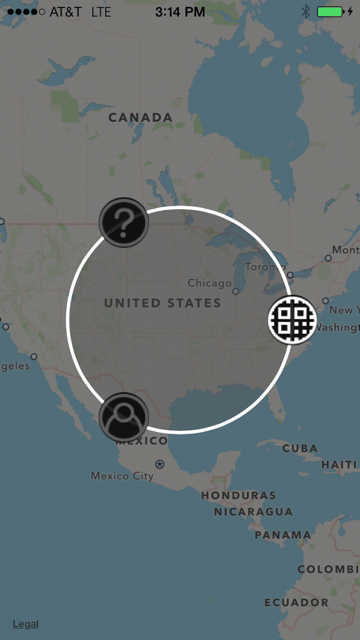
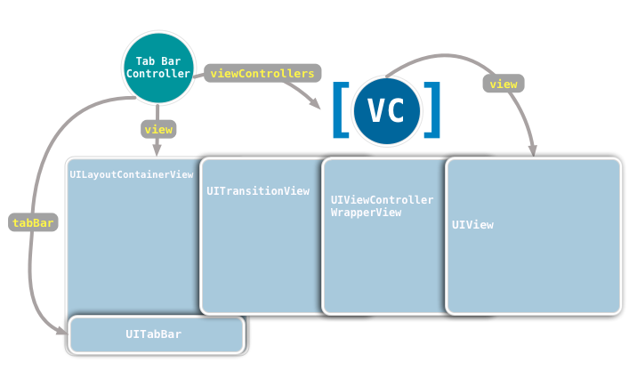
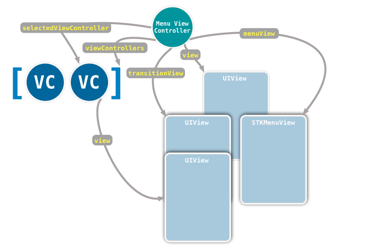

本文翻译自[View Controller Containers: Part II](http://stablekernel.com/blog/view-controller-containers-part-ii/)，感谢原作者的精彩文章。

请确认你已经看过了这个系列的[第一篇文章](http://stablekernel.com/blog/view-controller-containers-part-i/)。

在本篇文章中，我们将要实现一个全新的 view controller container，STKMenuViewController。回到我们上一篇介绍的container 的 ‘三巨头’ 的概念，让我们来看看我们这个 container 的对应关系：

	1.	STKMenuViewController的组织和遍历将和 UITabBarController 相同：有一个 view controllers 的列表，用户可以在任何时候从中选择。
	2.	STKMenuViewController的布局允许每一个 child view controller 的视图都是全屏展示的。刚开始时，在 view controllers 之间切换时并没有动画，但是我们会在后面的部分去增加动画相关的功能。
	3.	STKMenuViewController的 built-in interface 是一个全屏对的遮罩，当用户三指点击屏幕时，遮罩出现。
	
最后，当它的 built-in interface 可见时，STKMenuViewController看起来是这个样子的：

在屏幕上三指点击将会使这个环形菜单视图展现出来。每一个代表child view controller 的图标将会在这个环形上展现出来。点击图标，将会展现出对应的 view controller。点击其他地方将会隐掉这个菜单。

当实现一个 view controller container 时，最好是从屏幕上的展示元素开始。让我们来制定以下我们将要完成的目标：

	1.	可以创建一个STKMenuViewController的实例，并且把它设置为 window 的 root view controller.
	2.	能够提供给STKMenuViewController一个 view controllers 的列表，使其可以在这些 view controllers 之间切换。
	3.	能够展示这个列表中first view controller 的视图。

通过实现这些目标，我们将要涵盖“三巨头”概念的前两个的主要方面：组织/遍历 和 布局。但是我们不会详细的介绍每一行代码，你可以从 github 上得到源码。我们将要重点关注关键的部分已经隐藏在他们后面的概念。

###站在巨人的肩膀上

由于要实现的 container view controller 和 tab bar controller 的组织一样，在布局上也很相似，所以，让我们先来看看 tab bar controller 的视图层次：

没错，这是一个比较大的视图结构。tab bar controller 的 view 是一个 UILayoutContainerView 的实例。这个view 的子 view 是 tab bar 自己和一个 UITransitionView。这个 transition view 的子 view 是一个包含了selected view controller 的 view 的 UIViewControllerWrapperView。

这意味着，一个 tab bar controller 在新视图之间切换时遵从以下步骤：
	
	1.	新选中的 view controller 的 view 最为一个 subview 被包装到一个新的 UIViewControllerWrapperView 中，并且设置一些约束，这样这个新的 view 就能够适应它的 wrapper 的大小了。
	2.	这个 wrapper view 被加到 UITransitionView 上作为一个 subview，同时也需要设置一些约束以使其能够紧密贴合。
	3.	老的view 的 wrapper 被从 UITransitionView 中移除，这样也移除了老的 view。
	
这个视图结构的价值在于它很清楚的分离了每一个view角色，允许根据 tab bar controller 的基本行为进行划分。这就是 Programming 101 ：干净的角色分离通过减少在行为变化时需要改动的代码来最大程度的减少故障。而这种故障，其中一个变化产生另一个问题，是一个非常糟糕的类故障。

UILayoutContainerView 建立 tab bar 和 transition view 之间的相对布局只有一次。这也意味着当屏幕旋转时，这些规则的规则的建立也只有一次。通过把布局逻辑移到这个单独的 layer 中，不管我们将要切换到那个 view，tab bar controller 不需要从新建立约束条件，或者在布局它的界面时做一些额外的措施。

因此，UITransitionView 的position和 size是由它持有的关于 UILayoutContainerView 和 UITabBar的constraints决定的。这使得在视图之间的过渡遵从简单的步骤： 只需要把新的 view 和它的 wrapper 添加到这个 transition view 上，并且使其适配合适即可。
我们要是想改变 tab bar 的 size 或者 position，我们不需要改动视图切换相关的代码。

UIViewControllerWrapperView 的角色有一点不那么显而易见。为了理解它，我们需要首先理解一个 view controller 的最基本的规则就是它从不修改另外一个 view controller 的视图结构。这包括修改视图结构自身（添加或者移除视图）和改变 view 的各种属性（比如透明度和 frame）。

这条规则的原因很简单：弄糟另一个 view controller 的视图结构是不安全的。有三种可能的情况会发生。考虑一个例子，一个 view controller 试图去修改另外一个 view controller 的 button：

	[[someOtherViewController loginButton] setFrame:someFrame];
	
First possible type of failure, escalation level: ‘Aw, shucks.’ 这个`someOtherViewController`使用了一种机制来保证这个`loginButton`保持在原来的位置上，因此使这个代码没有效果。

Second possible type of failure, escalation level: ‘Oh, $#!@.’  这个`someOtherViewController`使用这个`loginButton`的位置作为其他元素的布局参考点，因此，整个界面都乱掉了或者一些约束不能被满足了，导致程序崩溃。

Third possible type of failure, escalation level: ‘You’re fired.’ 你想要改变`someOtherViewController`的接口，并且loginButton被从视图结构中移除了。现在你所有在外部访问loginButton的地方，都需要被重写。你不得不告诉你的客户或者老板，‘是的，我们确实可以做这种改变，但是它会影响其他的一些事情，并且你还需要为它们付钱。’ 在我看来，这是灾难性的失败。(Unless you are one of those shops that uses this ‘recurring revenue’ as a business plan, in that case, you probably aren’t reading this article anyway, because you’re currently downloading code off Github and Stackoverflow right now.)

不要弄糟另外一个 view controller 的视图结构，这条建议也同样适用于 container view controllers。但是，对于 container view controllers 有一个例外：你可以改变 view controller 的 root view 的 frame，以使其很好的适应于它们的布局之中。

这里的 wrapper view 可以使 tab bar controller 对另外一个 view controller 的 view拥有少量的控制权。比如，container view controller 决定是 child view controller 做一个渐隐动画，但是 child view controller 由于某些原因禁止改变 view 的 opacity 属性。container view controller 只需要改变 sapper view 的 opacity 就可以达到预想的效果了，而不会对 child view controller 产生其他副作用。因此，你可以认为 wrapper view 是一个 child view controller 的 view 的代理。

###实现STKMenuViewController

由于`STKMenuViewController`非常类似于`UITabBarController`，你可能会认为继承于`UITabBarController`应该会给我们带来不少的方便。很不幸的是，所有继承于`UITabBarController`的子类都给我们带来了很多让人头疼的麻烦。

对于子类化来说，tab bar controller 封装的太不透明了。它根本就没有考虑你可能会使用一个不同的控件了替换 UITabBar。几乎在所有你尝试隐藏 UITabBar 时都会碰到问题。如果有些tab bar items 太多而不能很好的布局在 UITabBar 中，它也把它的一些 child view controllers 包装在了一个 UINavigationController 中。这些都会导致我们在布局时的问题。

即使子类化 UITabBarController 可以工作，那也会是一个持久的问题。每一次 iOS 出了新版本，这些规则就会变化，而你也不得不跟着去做出改变。但是，tab bar controllers 真的没有那么的特别之处。它在很大程度上都是依赖于技术每个UIViewController 都有的提供给 container view controller 的功能。因此，在 UIViewController 的基础上模仿实现一个类似于 UITabBarController 的 container view controller 是非常直接的。

因此，在我们的STKMenuViewController中，我们将会使用 UIViewController 提供的对于 view controller container 支持的功能。我们将会采取和 UITabBarController 类似的方式，但是我们会省略 the wrapper view 这一层，因为我们知道我们不会对我们的 child view controller 做任何其他的改变。在实践中，你将会不得不根据如何复用 child view controller 来做出决定，wrapper view 是一个额外的中间层，你在想在工程中复用 container 时，可能会需要它。

我们想要在视图之间全屏切换，并且触发这种切换的也是一个全屏的遮罩。我们的视图结构如下所示：

注意一点，containerView 和 menuView 都是STKMenuViewController的 view 的subviews，并且 menuView 是在这个数组的最后面的。在 subviews 数组的最末端，意味着这个 menuView 总会出现在 containerView 和 containerView的 subviews(也就是 selected view controller 的 view) 的上面。

这个 menu view controller 的公共接口如下所示：

	@interface STKMenuViewController : UIViewController

	@property (nonatomic) int selectedViewControllerIndex;
	@property (nonatomic, copy) NSArray *viewControllers;

	// Don't change the properties of the menuView
	@property (nonatomic, weak, readonly) STKMenuView *menuView;
	@property (nonatomic, getter = isMenuVisible) BOOL menuVisible;

	- (void)setMenuVisible:(BOOL)menuVisible animated:(BOOL)animated;

	@end

These are all messages that another object can send to STKMenuViewController. Therefore, other objects can set the child view controllers and can select one of those view controllers from the list. They can also toggle the menu view itself – which is a class we’ll write later. We leave the menuView itself as a readonly property just in case someone wants to look at the values of the menuView, but really, we don’t want them changing properties of it so we leave a note there.

Internally, the STKMenuViewController will have two properties that it doesn’t expose to the outside world because it wants firm control over them. Therefore, in the implementation file, the class extension will look like so:

@interface STKMenuViewController ()

@property (nonatomic, weak) UIView *transitionView;
@property (nonatomic, weak) UIViewController *selectedViewController;

@end
The loadView method of STKMenuViewController will be responsible for setting up the view hierarchy. (We’ll implement STKMenuView later.) It looks like this:

- (void)loadView
{
    UIView *layoutView = [[UIView alloc] init];

    UIView *transitionView = [[UIView alloc] initWithFrame:[layoutView bounds]];
    [transitionView setAutoresizingMask:UIViewAutoresizingFlexibleHeight | UIViewAutoresizingFlexibleWidth];
    [layoutView addSubview:transitionView];

    STKMenuView *menuView = [[STKMenuView alloc] initWithFrame:[layoutView bounds]];
    [menuView setAutoresizingMask:UIViewAutoresizingFlexibleWidth | UIViewAutoresizingFlexibleHeight];
    [menuView setDelegate:self];
    [layoutView addSubview:menuView];

    [self setView:layoutView];
    [self setTransitionView:transitionView];
    _menuView = menuView;

    [self setMenuVisible:NO animated:NO];
}
This should all be straightforward. Notice we hang onto the two views we will need to access later: the transition view and the menu view.

A container view controller works just like a normal view controller: its view isn’t loaded until it is needed and it is sent appearance and rotation messages. This means we have to do two things. First, we need to establish the parent-child relationship between these view controllers to ensure appearance and rotation messages are automatically sent to the children when necessary.

Therefore, setViewControllers: looks like this:

- (void)setViewControllers:(NSArray *)viewControllers
{
    for(UIViewController *vc in [self viewControllers]) {
        [vc willMoveToParentViewController:nil];
        if([vc isViewLoaded] 
        && [[vc view] superview] == [self transitionView]) {
            [[vc view] removeFromSuperview];
        }
        [vc removeFromParentViewController];
    }

    _viewControllers = viewControllers;

    for(UIViewController *vc in [self viewControllers]) {
        [self addChildViewController:vc];
        [vc didMoveToParentViewController:self];
    }

    if([_viewControllers count] > 0) {
        [self setSelectedViewController:[_viewControllers objectAtIndex:0]];
    } else {
        [self setSelectedViewController:nil];
    }
}
Notice, first, that if the STKMenuViewController already has children, it dissolves the parent-child relationship between those view controllers and removes the view of the selected view controller from its hierarchy. When removing a child view controller, you must manually send willMoveToParentViewController: to the child and pass nil before removing it.

The reverse is true when adding the new children to the parent, they are first added and then manually send didMoveToParentViewController:. Once the children have established their relationship with the parent, the first view controller in the array is automatically selected. (But honestly, I have to look up which one has to be manually called in the documentation each time, so as long as you remember that you have to do something, you’ll be good.)

Note that there is no code for managing the view hierarchy here. That process is handled in setSelectedViewController:. The role of setViewControllers: is to establish parent-child relationships. The role of setSelectedViewController: is to manage the view hierarchy. This method gives the menu controller a uniform way of swapping between view controllers on their views, since we will do this from multiple places. It also helps us with the issue of not knowing whether or not the menu view controller has loaded its view.

- (void)setSelectedViewController:(UIViewController *)selectedViewController
{
    if(![[self viewControllers] containsObject:selectedViewController]) {
        return;
    }

    UIViewController *previous = [self selectedViewController];

    _selectedViewController = selectedViewController;

    if([self isViewLoaded]) {
        [[previous view] removeFromSuperview];

        UIView *newView = [[self selectedViewController] view];
        [newView setFrame:[[self transitionView] bounds]];
        [newView setAutoresizingMask:UIViewAutoresizingFlexibleHeight | UIViewAutoresizingFlexibleWidth];
        [[self transitionView] addSubview:newView];
    }
}
This method ensures that the view controller it is selecting is actually one of its children – which is unlikely, since setSelectedViewController: is not exposed to the public, but might as well check. Then, if and only if the menu view controller’s view has been loaded, the views are swapped. Notice we’re adding the selected view controller’s view to the transitionView based on our earlier conversation about separating roles.

Since setViewControllers: and therefore setSelectedViewController: can be called before the menu view controller has loaded its view, it is possible that the selected view won’t appear once the view is loaded. For that reason, we must call setSelectedViewController: again in viewDidLoad.

- (void)viewDidLoad
{
    [super viewDidLoad];

    [self setSelectedViewController:[self selectedViewController]];
}
Once setSelectedViewController: runs again, the instance variable _selectedViewController won’t change, but its view will now be in the menu view controller’s view hierarchy.

The final property to implement before we move into the next article (where we will implement the menu view) is selectedViewControllerIndex. This comes with a valuable lesson. We have a selectedViewController property – a pointer to the selected view controller – and the array of all the view controllers. Instead of storing the index as an integer value and keeping selectedViewController and selectedViewControllerIndex in sync, we will derive selectedViewControllerIndex from the information we already have.

- (int)selectedViewControllerIndex
{
    return (int)[[self viewControllers] indexOfObject:[self selectedViewController]];
}
The value to this approach is that we don’t open up ourselves to the error of the index and the selected view controller becoming out of sync. The setter method for this property then forwards the actual work of selecting a view controller onto our one-stop shop, setSelectedViewController:, after performing some bounds checking:

- (void)setSelectedViewControllerIndex:(int)selectedViewControllerIndex
{
    if(selectedViewControllerIndex < 0
    || selectedViewControllerIndex >= [[self viewControllers] count]
    || selectedViewControllerIndex == [self selectedViewControllerIndex])
        return;

    [self setSelectedViewController:[[self viewControllers] objectAtIndex:selectedViewControllerIndex]];
}
Since we don’t have an instance variable for selectedViewControllerIndex, you can go ahead and make it dynamic in the implementation block:

@dynamic selectedViewControllerIndex;
In the next article, we’ll implement STKMenuView and hook it up to a gesture recognizer. This will allow the user to swap between view controllers.

