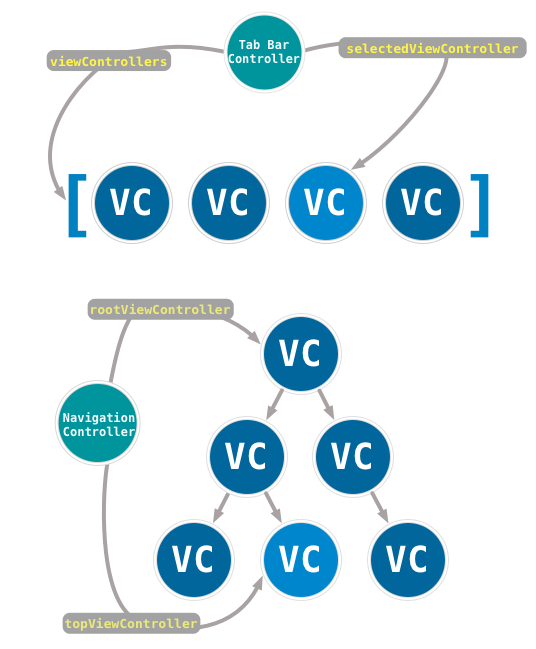
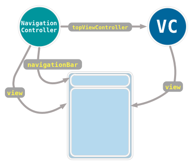
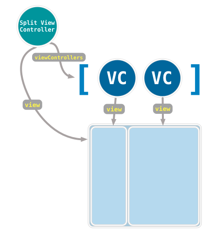
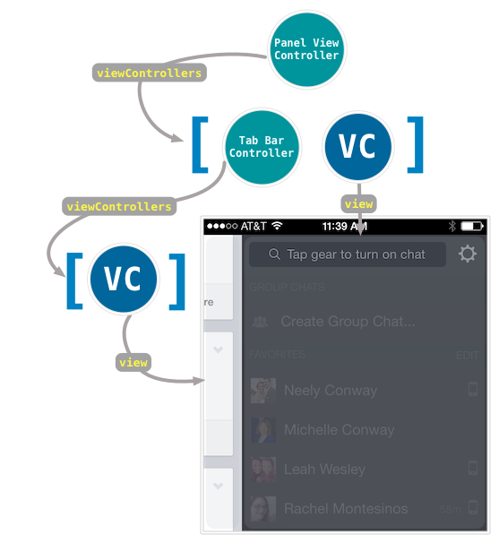

本文翻译自[View Controller Containers: Part I](http://stablekernel.com/blog/view-controller-containers-part-i/)，感谢原作者的精彩文章。

越来越多的开发者现在使用非标准的用户界面在iOS应用中组织屏幕。随着这些用户交互被越多的引入，程序员就可能陷入使代码越来越复杂的陷阱，这将导致在调试、维护和可用性方面的麻烦。

这样的陷阱包括：没有正确的利用view controller的层次结构，在一个view controller里塞入了太多的view和功能，把container的职责遗留给了 child view controllers，在 child view controllers 和它们的 parent 之间耦合严重，引入了中间的抽象 view controller 类来把 containers 和 child view controllers 整合在一起，或者只是简单的避免所有的 view controllers 都在一起。

这篇文章是关于实现 view controller containers 并且利用animated transitions的优势的系列文章的第一篇。在第一期中，我们通过考察系统提供的一些现有的 view controller containers，并为一些我们将要在整个系列教程中都要使用的术语奠定基础。

为了保证自定义 view controller container 的创建，你必须修改下面这些方面的一种：

	1.	container view controller 中view controller 的组织和遍历。
	2.	每一个 view controller 的视图的布局。
	3.	用于切换视图控制器的的内置界面元素。
	
这些概念和术语 (organization and traversal, layout and animation, and built-in interface)，将是我们讨论 view controller container 的核心问题。

###容器的组织和遍历

有两种标准的container view controller，你几乎在所有的应用中都会看到它们，这就是 UINavigationControlle 和 UITabBarController 。这两种 container 使用了不同的方式来组织和遍历它们的 view controllers。我们这里所说的组织并不是说它们的视图如何在屏幕上布局，而是如果你把这些 container view controllers 画出一幅示意图，什么样的数据结构可以更好的描述这个 view controller 的组织结构？

Tab bar controller 把它的 view controllers 组织在一个列表里。这个列表里的每一个 view controller 可以在任何时候被切换到，而不需要依赖于列表中的任何其他 view controller。

 Navigation controller 把他的 view controllers 组织在一个树形结构中。（我们总是听到一个 navigation controller 维护了一个 view controllers 的栈，但是这仅仅是它的存储结构的实现，以及它是如何操作的。）在 navigation controller 树形结构中的 view controllers 以某种方式相互联系；either as steps in the same process or different levels of detail for the same information。在树形结构中的 view controller 决定了下一级可能的 view controllers，并且只能返回带它的树形结构中上一层的 view controller。
 
事实证明，树形结构和列表结构几乎覆盖了所有我们能想到的 view controller 的组织和遍历。当创建我们自定义的 view controller containers 时，我们不太可能想到一种和 UINavigationController 和 UITabBarController 组织结构不一样的 container。尽管你可能比我要聪明，并且发现了一种新的有趣的数据结构来组织 view controllers ，比如图和矩阵。

###Container 的布局

View controller container 决定了它的 view controllers 的视图出现在哪里。像 tab bar 和 navigation controller 这样的 containers，有几乎相同的布局：有一个 active view controller 是可见的，并且 container view controller 的控件(navigation bar  和 tab bar)是一直可见的。

UISplitViewControllers 采用了一种不同的方式来组织布局，与同时只能有一个 view controller处于可见状态不同的是，一个 split view controller 可以同时展示两个紧挨着的 view controllers。

 view controller container 的布局就是我们自定义的 containers 可以有创造性的地方。想一想 Facebook iOS 应用，在main view controller上向左轻划，就会在右边出现一个聊天面板。这个面板是它自己的 view controller。这种布局有点像 UISplitViewController，但是足够的差异性可以保证这种自定义的 container view controller 的创新性。
 

在这里需要注意一点，这个 container 包含了另外一个 container：main view controller 是一个有自己的 view controller 列表的 UITabBarController。当我们实现我们自己的容器时遵循所有的规则，这个容器串联起来会工作的很好。

navigation controller 在 推入和推出 view controllers 时也实现了滑动动画。tab bar controller 没有默认的动画。但是所有的这些 containers 都允许你自定义切换 view controller时的转场动画。我们将在本系列的后面介绍自定义转场动画。

###Container Built-In Interface

最后一个保证自定义container 的元素是 container's built-in interface。这个 built-in interface 是一个被 container view controller 自己持有的 view 。通常，the built-in interface 允许用户从一个 view controller 切换到 container 中的另一个 view controller.

举例来说，tab bar controller有一个tab bar，这个 tab bar 就是可以在每一个 view controller 之间进行导航的 interface。同样的，navigation controller 有一个 navigation bar。（不同的是，split view controller 并没有built-in interface，并且只是显示它的 view controllers 的视图。）

the built-in interface 通常都是我们自定义的主要区域。作为一个例子，the Richtree Markets application 使用一个带有下拉菜单的 navigation bar, 在不同的 view controllers 之间进行导航。

这个 container 的组织和遍历和 UITabBarController 是相同的。布局也很像，有一个 active view controller 的视图和切换到其他 view controller 的 interface。但是这个切换 view controller 的控件是很不同的。

了解了我们的三个概念和术语，我们将使用下一篇文章实现一个全新的container view controller。敬请关注。